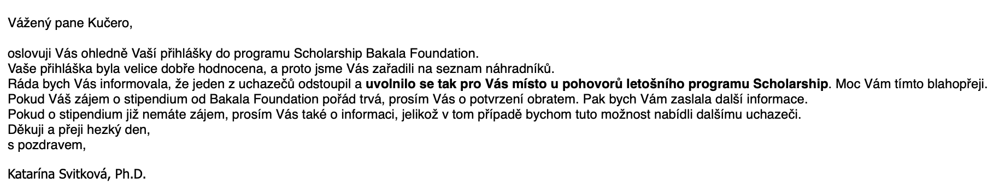
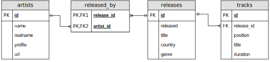
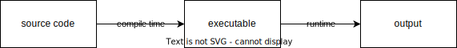
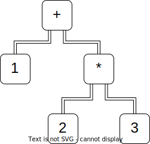

<div style="text-align: center">

</div>

---

# FIT anketa funguje

---

<div style="text-align: center">

</div>

---

# Zkus to, i když si nevěříš

---

<div style="text-align: center">

</div>

---

<div style="text-align: center">

</div>

---

<div style="text-align: center">

</div>

# Neboj se zeptat

---

<div style="text-align: center">

</div>

---

# Type safety

```python
def add_numbers(a, b):
    return a + b
```

---

```python
result = add_numbers(5, "10")
print(result)
```

. . .

```txt
Traceback (most recent call last):
  File "/Users/martin/Documents/FIT prednaska/test.py", line 4, in <module>
    result = add_numbers(5, "10")
             ^^^^^^^^^^^^^^^^^^^^
  File "/Users/martin/Documents/FIT prednaska/test.py", line 2, in add_numbers
    return a + b
           ~~^~~
TypeError: unsupported operand type(s) for +: 'int' and 'str'
```

---

```java
public class Calculator {

    public static int addNumbers(int a, int b) {
      return a + b;
    }

}
```

---

```java
Calculator.addNumbers(5, "10");
```

```txt
Main.java:11: error: incompatible types: String cannot be converted to int
    Calculator.addNumbers(5, "10");
```

---

```scala
case class Account(id: String, currency: Currency)
case class Agent(id: String, active: Boolean)

class OrderService:
  def placeOrder(accountId: String, agentId: String, ...): Unit
```

---

```scala
orderService.placeOrder(agent.id, account.id, ...)
```

---

```scala
case class AccountId(value: String)
case class AgentId(value: String)

case class Account(id: AccountId, currency: Currency)
case class Agent(id: AgentId, active: Boolean)

class OrderService:
  def placeOrder(accountId: AccountId, agentId: AgentId, ...): Unit
```

---

```scala
orderService.placeOrder(agent.id, account.id, ...)
```

```txt
-- [E007] Type Mismatch Error: -------------------------------------------------
1 |orderService.placeOrder(agent.id, account.id)
  |                        ^^^^^^^^
  |                        Found:    (agent.id : AgentId)
  |                        Required: AccountId
  |
  | longer explanation available when compiling with `-explain`
-- [E007] Type Mismatch Error: -------------------------------------------------
1 |orderService.placeOrder(agent.id, account.id)
  |                                  ^^^^^^^^^^
  |                                  Found:    (account.id : AccountId)
  |                                  Required: AgentId
  |
  | longer explanation available when compiling with `-explain`
2 errors found
```

# Scala crash course
... like Java but better!

# Type inference
```scala
def addNumbers(a: Int, b: Int): Int = a + b

val result: Int = addNumbers(5, 10)
println(result)
```

# Type inference
```scala
def addNumbers(a: Int, b: Int): Int = a + b

val result = addNumbers(5, 10)
println(result)
```

# Všechno je expression
```scala
val greeting = 
  val hour = java.time.LocalTime.now().getHour
  if hour < 12 then
    "Good morning!"
  else
    "Good afternoon!"
```

# Typová hierarchie


# Všechno je expression
```scala
val s: String = readInput()
val i: Int =
  if s.forall(_.isDigit) then
    s.toInt
  else
    throw new Exception(s"$s is not an integer")
```

# Všechno je objekt
```scala
val number = -10
println(number.sign) // -1
```

. . .

```scala
1 + 2 == 1.+(2)
```

# Funkce je taky objekt
```scala
val f: Function2[Int, Int, Int] =
  (x: Int, y: Int) => x + y

f(1, 2) == f.apply(1, 2)
```

# Všechno je funkce
```scala
val digitToText = Map(
  0 -> "zero",
  1 -> "one",
  2 -> "two",
  3 -> "three",
)
digitToText(1) // "one"

val number = 123
val str =
  number               // 123
    .toString          // "123"
    .map(_.asDigit)    // ArraySeq(1, 2, 3)
    .map(digitToText)  // ArraySeq("one", "two", "three")
    .mkString(" ")     // "one two three"
```

# Singleton objekty
```scala
object Logger:
  def log(msg: String): Unit =
    println(msg)

Logger.log("Hello, world!")
```

# Type safety a databáze
```scala
import java.sql.*

val connection = DriverManager.getConnection("jdbc:postgresql://...")
val st = connection.createStatement()
val rs = st.executeQuery("SELECT 'Hello, world!'")
```

# Discogs databáze

<div style="text-align: center">

</div>

# Problém na straně DB

```scala
st.executeQuery("SELECT * FROM artists WHERE name >= 7")
```

# Problém na straně klienta #1
```scala
val rs = st.executeQuery("SELECT title, position FROM tracks");
while rs.next() do
  val title = rs.getString("title")
  val pos = rs.getInt("position")
  println(s"$pos. $title")
```

. . .

```txt
org.postgresql.util.PSQLException: Bad value for type int : A
  at org.postgresql.jdbc.PgResultSet.toInt(PgResultSet.java:3205)
  at org.postgresql.jdbc.PgResultSet.getInt(PgResultSet.java:2422)
  at org.postgresql.jdbc.PgResultSet.getInt(PgResultSet.java:2817)
  ... 32 elided
```

# Problém na straně klienta #2
```scala
val rs = st.executeQuery("SELECT title, position FROM tracks");
while rs.next() do
  val title = rs.getString("title")
  val pos = rs.getString("position")
  val duration = rs.getString("duration")
  println(s"$pos. $title ($duration)")
```

. . .

```txt
org.postgresql.util.PSQLException: The column name duration was not found in this ResultSet.
  at org.postgresql.jdbc.PgResultSet.findColumn(PgResultSet.java:3033)
  at org.postgresql.jdbc.PgResultSet.getString(PgResultSet.java:2888)
  ... 32 elided
```

# Co bychom chtěli
```scala
val res = findAllTracks()
  .filter: track =>
    track.release.id == 10 || track.release.id == 12
  .filter(_.title.startsWith("Hello"))
  .sortBy(_.title)

for track <- res do
  println(s"${track.title} ${track.release.title}")
```

# Tyqu
```scala
object Releases extends Table:
  val id = Column[Int](primary = true)
  val title = Column[String]()
  val genre = Column[String]()
  ...
  lazy val tracks = OneToMany(Tracks, Tracks.release)


object Tracks extends Table:
  val id = Column[Int](primary = true)
  val releaseId = Column[Int]()
  val title = Column[String]()
  val duration = Column[Int]()
  ...
  lazy val release = ManyToOne(Releases, releaseId)
```

# Tyqu
```scala
val res = from(Tracks)
  .filter: track =>
    track.release.id == 10 || track.release.id == 12
  .filter(_.title.startsWith("Hello"))
  .sortBy(_.title)
  .map: track =>
    (
      track.title.as("track"),
      track.release.title.as("release"),
    )
  .execute()

for row <- res do:
  println(s"${row.track} ${row.release}")
```

# Tyqu: Demo

# Scala deep dive

# Structural types
```scala
class Record(fields: Map[String, Any]) extends Selectable:
  def selectDynamic(name: String): Any = fields(name)


val person = Record(Map(
    "name" -> "Emma",
    "age" -> 42,
  )).asInstanceOf[Record & { val name: String; val age: Int }]


println(person.name)
```

# Metaprogramování
<div style="text-align: center">

</div>

# AST
```scala
1 + 2 * 3
```

. . .

<div style="text-align: center">

</div>

# Inline funkce
```scala
inline def perimeter(radius: Double): Double =
  2 * 3.14 * radius
```

. . .

```scala
val p = perimeter(5.0)
```

. . .

```scala
val p = 2 * 3.14 * radius
```

# Makra
```scala
import scala.quoted.*

object Macro:
  inline transparent def show(inline v: Any): Any =
    ${ showImpl('v) }

  private def showImpl(v: Expr[Any])(using Quotes): Expr[Any] =
    import quotes.reflect.*
    println(v.asTerm)
    v
```

---

```scala
Macro.show(5.0)
```

. . .

```
Literal(Constant(5.0))
```

---

```scala
val x = 1
Macro.show(x + 2)
```

. . .

```
Apply(Select(Ident(x),+),List(Literal(Constant(2))))
```

---

```scala
Macro.show(Map(
  "name" -> "Emma",
  "age" -> 42,
))
```

. . .

```
Apply(TypeApply(Select(Ident(Map),apply),List(TypeTree[TypeRef(ThisType(TypeRef(NoPrefix,module class lang)),class String)], TypeTree[OrType(TypeRef(ThisType(TypeRef(NoPrefix,module class lang)),class String),TypeRef(ThisType(TypeRef(NoPrefix,module class scala)),class Int))])),List(Typed(SeqLiteral(List(Apply(TypeApply(Select(Apply(TypeApply(Ident(ArrowAssoc),List(TypeTree[TypeRef(ThisType(TypeRef(NoPrefix,module class lang)),class String)])),List(Literal(Constant(name)))),->),List(TypeTree[TypeRef(ThisType(TypeRef(NoPrefix,module class lang)),class String)])),List(Literal(Constant(Emma)))), Apply(TypeApply(Select(Apply(TypeApply(Ident(ArrowAssoc),List(TypeTree[TypeRef(ThisType(TypeRef(NoPrefix,module class lang)),class String)])),List(Literal(Constant(age)))),->),List(TypeTree[TypeRef(ThisType(TypeRef(NoPrefix,module class scala)),class Int)])),List(Literal(Constant(42))))),TypeTree[AppliedType(TypeRef(ThisType(TypeRef(NoPrefix,module class scala)),class Tuple2),List(TypeRef(ThisType(TypeRef(NoPrefix,module class lang)),class String), OrType(TypeRef(ThisType(TypeRef(NoPrefix,module class lang)),class String),TypeRef(ThisType(TypeRef(NoPrefix,module class scala)),class Int))))]),TypeTree[AppliedType(TypeRef(ThisType(TypeRef(NoPrefix,module class scala)),class <repeated>),List(AppliedType(TypeRef(ThisType(TypeRef(NoPrefix,module class scala)),class Tuple2),List(TypeRef(ThisType(TypeRef(NoPrefix,module class lang)),class String), OrType(TypeRef(ThisType(TypeRef(NoPrefix,module class lang)),class String),TypeRef(ThisType(TypeRef(NoPrefix,module class scala)),class Int))))))])))
```

# Tyqu: internals
```scala
class QueryBuilder[S <: Scope](
  scope: S,
  from: FromRelation[?] | SubqueryRelation,
  where: Expression[Boolean] = NoFilterExpression,
  orderBy: List[OrderBy] = List.empty,
):
  def map[S2 <: Scope](fn: S => S2): QueryBuilder[S2]
  def filter(predicate: S => Expression[Boolean]): QueryBuilder[S]
  def sortBy(fn: S => OrderBy | Tuple): QueryBuilder[S]
  def execute()(using executor: QueryExecutor): Iterator[Result[S]]
```

---

```scala
transparent inline def map(fn: S => Tuple): QueryBuilder[?] =
  val selection = fn(scope)
  this
    .copy(scope = TupleScope(selection))
    .asInstanceOf[QueryBuilder[TupleScope & { /* generated by macro */}]]
```

# Reklama

# #lang-talk meetups
[github.com/lang-talk/meetups](https://github.com/lang-talk/meetups)

# Milý Ježíšku
[www.milyjezisku.eu](https://milyjezisku.eu/)

# Shrnutí
 - Neboj se zeptat
 - Scala je cool
 - Tyqu je cool

[github.com/KuceraMartin/tyqu](https://github.com/KuceraMartin/tyqu)

# Backup

# Tyqu: Expression
```scala
abstract class Expression[T]
abstract class NamedExpression[T, Name <: String & Singleton] extends Expression[T]

case class LiteralValue[T](value: T) extends Expression[T]
case class ColumnValue[T, Name <: String & Singleton] extends NamedExpression[T, Name]

case class IsNull(e: Expression[?]) extends Expression[Boolean]
case class And(lhs: Expression[Boolean], rhs: Expression[Boolean]) extends Expression[Boolean]
case class Plus[T1 <: Numeric, T2 <: Numeric](lhs: Expression[T1], rhs: Expression[T2]) extends Expression[T1 | T2]
```
